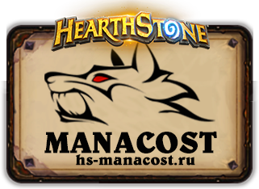
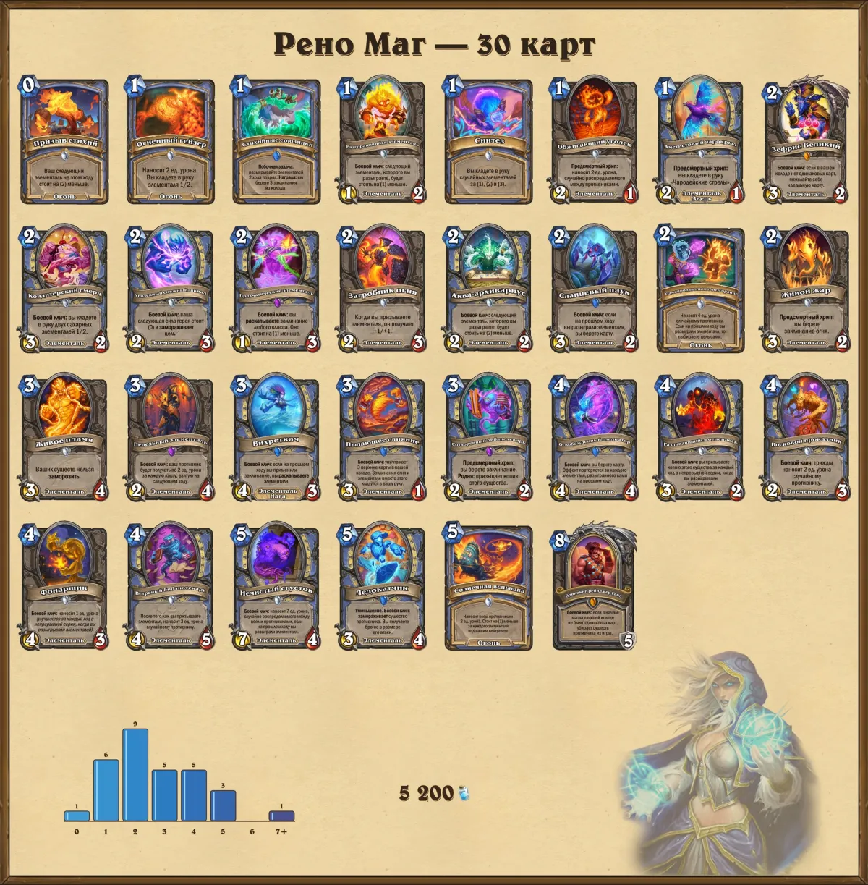
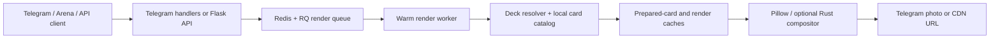

<div align="center">
  
  <h1>Deckview</h1>
  <p><strong>Telegram-бот и HTTP API для быстрых изображений колод Hearthstone</strong></p>
  <p>
    <a href="https://t.me/manacostcard_bot"></a>
    <a href="https://github.com/Zulut30/deckview-telegram-bot/actions/workflows/tests.yml"></a>
    
    
  </p>
</div>

Deckview распознаёт код колоды, получает актуальные данные карт, собирает изображение и отправляет его в Telegram либо возвращает через API. Классический, пергаментный и пользовательский стили используют один детерминированный конвейер рендера и общий кеш.



## Возможности

| Возможность | Что получает пользователь |
|---|---|
| Telegram | Автораспознавание deckstring, ответ на исходное сообщение, копирование кода, скачивание и избранное |
| Рендер | Классика, пергамент, пользовательский фон, градиенты, шрифты, blur, арт класса и настраиваемая нижняя область |
| Карты | Локальная метаинформация Kolodahs, изображения через Arena CDN, подготовленные карточки и запасные источники |
| Колоды | Стандарт/Вольный, sideboard, 30- и 40-карточные Reno-колоды, архетипы HSGuru |
| Производительность | Redis/RQ, дедупликация запросов, versioned render cache, локальный каталог карт и Telegram `file_id` cache |
| Web/API | Рендер, перевод названий, распознавание архетипа, публикация и административный dashboard |

## Как устроено



Подробности: [архитектура](docs/ARCHITECTURE.md), [HTTP API](docs/API.md), [развёртывание](docs/DEPLOYMENT.md).

## Быстрый старт

Требуются Python 3.10+, Redis (для очереди) и системные библиотеки Pillow.

```bash
git clone https://github.com/Zulut30/deckview-telegram-bot.git
cd deckview-telegram-bot
python3 -m venv .venv
. .venv/bin/activate
pip install -r requirements.txt
cp .env.example .env
```

Заполните минимум `TOKEN` и `BATTLE_NET_TOKEN`, затем запустите:

```bash
python main.py                    # Telegram-бот
python web_app.py                 # Web/API
rq worker deckview                # фоновый рендер
```

## Проверка изменений

```bash
make test
make reno
```

`make reno` обязательно проверяет и строит две эталонные singleton-колоды: Reno на 30 карт и XL Reno на 40 карт. Получившиеся файлы находятся в `artifacts/reno-regression/` и не попадают в Git.

Для Codex в репозитории есть `$deckview-maintainer`: он описывает безопасный workflow, проверки производительности и обязательный визуальный прогон двух Reno-колод. Правила проекта находятся в [AGENTS.md](AGENTS.md).

## Структура

```text
image_creator/       декодирование, данные карт и композиция изображения
framework/           HTTP-клиенты и внешние Hearthstone-источники
deckview_*           очередь, jobs и worker тяжёлого рендера
render_cache.py      versioned cache готовых изображений
web_app.py           Flask API и web-интерфейс
web_db.py            персистентность настроек и истории
main.py              Telegram orchestration
tests (test_*.py)    регрессии бота, API, кешей и рендера
```

## Разработка

Изменения приветствуются через небольшие PR с тестами. Перед отправкой прочитайте [CONTRIBUTING.md](CONTRIBUTING.md) и [SECURITY.md](SECURITY.md). Архитектурные решения фиксируются в `docs/decisions/`.

Deckview распространяется по лицензии [MIT](LICENSE). Hearthstone и связанные материалы принадлежат Blizzard Entertainment; проект не аффилирован с Blizzard.
