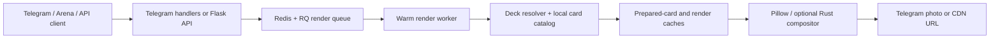

<div align="center">
  
  <h1>Deckview</h1>
  <p><strong>Telegram-бот и HTTP API для быстрых изображений колод Hearthstone</strong></p>
  <p>
    <a href="https://t.me/manacostcard_bot"></a>
    <a href="https://github.com/Manacost-Labs/Deckview-TG/actions/workflows/tests.yml"></a>
    
    <a href="LICENSE"></a>
  </p>
</div>

Deckview распознаёт код колоды, получает актуальные данные карт, собирает изображение и отправляет его в Telegram либо возвращает через API. Классический, пергаментный и пользовательский стили используют один детерминированный конвейер рендера и общий кеш.


## Возможности

| Возможность | Что получает пользователь |
|---|---|
| Telegram | Автораспознавание deckstring, ответ на исходное сообщение, копирование кода, скачивание и избранное |
| Рендер | Классика, пергамент, пользовательский фон, градиенты, шрифты, blur, арт класса и настраиваемая нижняя область |
| Карты | Локальная метаинформация Kolodahs, изображения через Arena CDN, подготовленные карточки и запасные источники |
| Колоды | Стандарт/Вольный, sideboard, 30- и 40-карточные Reno-колоды, архетипы HSGuru |
| Производительность | Redis/RQ, дедупликация запросов, versioned render cache, локальный каталог карт и Telegram `file_id` cache |
| Web/API | Рендер, перевод названий, распознавание архетипа, публикация и административный dashboard |

## Как устроено



Подробности: [архитектура](docs/ARCHITECTURE.md), [HTTP API](docs/API.md), [развёртывание](docs/DEPLOYMENT.md).

Экспериментальный нативный композитор на Rust собирается отдельно и по
умолчанию выключен. Инструкции, контракт и обязательные проверки описаны в
[документе о Rust-рендерере](docs/NATIVE_RENDERER_EXPERIMENT.md).

## Быстрый старт

Требуются Python 3.10+, Redis (для очереди) и системные библиотеки Pillow.

```bash
git clone https://github.com/Manacost-Labs/Deckview-TG.git
cd deckview-telegram-bot
python3 -m venv .venv
. .venv/bin/activate
pip install -r requirements.txt
cp .env.example .env
```

Заполните минимум `TOKEN` и `BATTLE_NET_TOKEN`, затем запустите:

```bash
python -m deckview                         # Telegram-бот
python -m deckview.web.application         # Web/API для разработки
python -m deckview.workers.worker          # production render workers
```

## Проверка изменений

```bash
make test
make reno
```

`make reno` обязательно проверяет и строит две эталонные singleton-колоды: Reno на 30 карт и XL Reno на 40 карт. Получившиеся файлы находятся в `artifacts/reno-regression/` и не попадают в Git.

Для Codex в репозитории есть `$deckview-maintainer`: он описывает безопасный workflow, проверки производительности и обязательный визуальный прогон двух Reno-колод. Правила проекта находятся в [AGENTS.md](AGENTS.md).

## Структура

```text
deckview/
├── bot/             lifecycle, composition root и Telegram utilities
├── handlers/        aiogram transport adapters
├── services/        use cases без Telegram-зависимостей
├── integrations/    Arena, HSGuru, Manacost и внешние API
├── repositories/    SQLite persistence
├── workers/         Redis/RQ queue, jobs и warm workers
├── infrastructure/  render/file_id cache и telemetry
└── web/             Flask API и dashboard
image_creator/       декодирование, данные карт и композиция изображения
framework/           общая HTTP/Hearthstone инфраструктура
tests/               architecture, integration и render regressions
scripts/             проверки, regression render и служебные команды
deploy/              systemd, Nginx и атомарный GitHub deployment
```

Корень репозитория не содержит Python-модулей. Исторические import aliases
удалены: бот, Web API и worker запускаются напрямую из пакета `deckview`.
Контракт защищён architecture-тестами и командой
`python scripts/check_package_imports.py`.

GitHub Actions компилирует пакет и запускает все тесты для каждого PR. Ручной
production workflow строит immutable release, проверяет Reno-колоды на 30/40
карт, атомарно переключает `current` и откатывается при ошибке health-check.
Подробности — в [руководстве по развёртыванию](docs/DEPLOYMENT.md).

## Разработка

Изменения приветствуются через небольшие PR с тестами. Перед отправкой прочитайте [CONTRIBUTING.md](CONTRIBUTING.md) и [SECURITY.md](SECURITY.md). Архитектурные решения фиксируются в `docs/decisions/`.

## Лицензия

Copyright © 2026 Zulut30.

Deckview распространяется на условиях
[GNU Affero General Public License v3.0 или более поздней версии](LICENSE)
(`AGPL-3.0-or-later`). Копии и производные работы разрешено использовать,
изменять и распространять только с сохранением этой лицензии и доступом к
соответствующему исходному коду. Если изменённая версия взаимодействует с
пользователями по сети — например, работает как бот, сайт или API — этим
пользователям также должен быть предложен доступ к её полному исходному коду.

AGPL распространяется на производные работы на основе кода Deckview, но не на
независимую реализацию той же идеи, которая не копирует охраняемый код проекта.

Отдельные исходные компоненты и ранее опубликованные версии сохраняют свои
первоначальные права; обязательные уведомления перечислены в
[THIRD_PARTY_NOTICES.md](THIRD_PARTY_NOTICES.md). Hearthstone и связанные
материалы принадлежат Blizzard Entertainment; проект не аффилирован с Blizzard.
