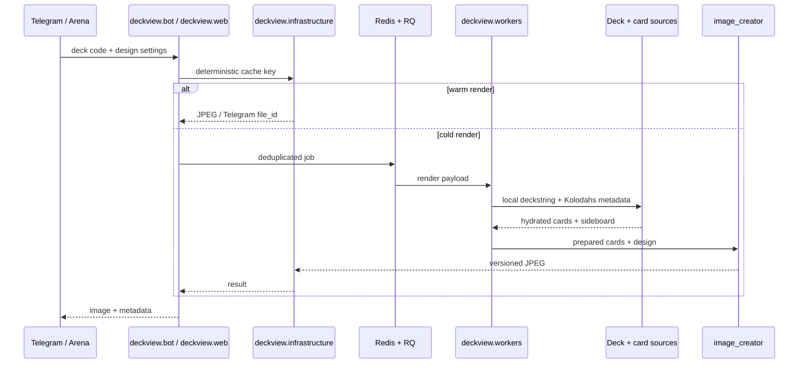

# Архитектура Deckview

Deckview обслуживает два интерактивных канала — Telegram и HTTP API — поверх одного конвейера данных и рендера. Тяжёлая работа вынесена из обработчиков в прогретые RQ workers; одинаковые запросы дедуплицируются и используют versioned cache.

## Поток запроса

## Компоненты

| Компонент | Ответственность |
|---|---|
| `deckview/bot/` | Telegram lifecycle, composition root и UX orchestration |
| `deckview/handlers/` | изолированные aiogram routers |
| `deckview/services/` | use cases без зависимости от Telegram |
| `deckview/workers/queue.py` | постановка задач, дедупликация и ожидание результата |
| `deckview/workers/jobs.py` | сериализуемые фоновые задачи и формирование ответа |
| `deckview/workers/worker.py` | preload каталогов/ассетов и запуск RQ worker |
| `image_creator/deck_retriever.py` | локальный deckstring, формат, sideboard и fallback Blizzard |
| `image_creator/deck_card_sources.py` | метаданные Kolodahs/HSJSON и нормализация карт |
| `image_creator/prepared_card_cache.py` | подготовленные к композиции изображения карт |
| `image_creator/cards_placer.py` | единая сетка, оформление, манакривая, пыль и арт класса |
| `deckview/infrastructure/` | render/file_id cache и telemetry |
| `deckview/web/` | Flask endpoints, dashboard и API orchestration |
| `deckview/repositories/` | настройки пользователей/чатов, история и публикации |
| `framework/` | HTTP sessions и адаптеры внешних источников |

В корне репозитория нет Python-модулей и compatibility aliases. Канонические
точки запуска: `python -m deckview`, `deckview.web.application:app` и
`python -m deckview.workers.worker`.

## Инварианты рендера

- Main deck и sideboard декодируются раздельно.
- 30- и 40-карточные Reno-колоды содержат только singleton main cards.
- Все карточки размещаются в общей геометрической сетке: одинаковый bounding box, baseline и gap.
- Пользовательский фон не получает пергаментный цветовой слой.
- Cache key включает код колоды, нормализованный дизайн и версии renderer/template/card data.
- Обновление карт или дизайна меняет версию/ключ и не возвращает устаревшее изображение.

## Производительность

Горячий путь не должен обращаться к внешним API. Worker заранее загружает локальный каталог карт; карты скачиваются параллельно и сохраняются в prepared-card cache. Render cache хранит готовый JPEG, а Telegram cache — серверный `file_id`.

Метрики этапов (`deck_resolve`, `card_sources`, `art_prepare`, `card_index`, `dust_cost`, `image_compose`) собираются через `deckview.infrastructure.perf_telemetry`. Любая оптимизация должна сравнивать холодный и тёплый прогон одной и той же колоды.

## Технический долг

`deckview.bot.application` всё ещё содержит исторические handlers, которые будут
переноситься вертикальными срезами. Новая бизнес-логика уже обязана идти через
`handler -> service -> repository/integration`; Python-модули в корне запрещены
architecture-тестом.
