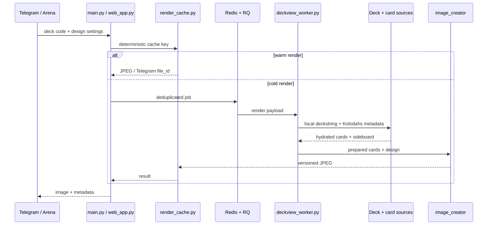

# Архитектура Deckview

Deckview обслуживает два интерактивных канала — Telegram и HTTP API — поверх одного конвейера данных и рендера. Тяжёлая работа вынесена из обработчиков в прогретые RQ workers; одинаковые запросы дедуплицируются и используют versioned cache.

## Поток запроса

## Компоненты

| Компонент | Ответственность |
|---|---|
| `main.py` | Telegram update routing, настройки, команды и UX сообщений |
| `deckview_queue.py` | постановка задач, дедупликация и ожидание результата |
| `deckview_jobs.py` | сериализуемые фоновые задачи и формирование ответа |
| `deckview_worker.py` | preload каталогов/ассетов и запуск RQ worker |
| `image_creator/deck_retriever.py` | локальный deckstring, формат, sideboard и fallback Blizzard |
| `image_creator/deck_card_sources.py` | метаданные Kolodahs/HSJSON и нормализация карт |
| `image_creator/prepared_card_cache.py` | подготовленные к композиции изображения карт |
| `image_creator/cards_placer.py` | единая сетка, оформление, манакривая, пыль и арт класса |
| `render_cache.py` | ключ по deckstring + дизайну + версиям renderer/data/template |
| `telegram_photo_cache.py` | повторная отправка через Telegram `file_id` без upload |
| `web_app.py` | Flask endpoints, dashboard и API orchestration |
| `web_db.py` | настройки пользователей/чатов, история и публикации |
| `framework/` | HTTP sessions и адаптеры внешних источников |

## Инварианты рендера

- Main deck и sideboard декодируются раздельно.
- 30- и 40-карточные Reno-колоды содержат только singleton main cards.
- Все карточки размещаются в общей геометрической сетке: одинаковый bounding box, baseline и gap.
- Пользовательский фон не получает пергаментный цветовой слой.
- Cache key включает код колоды, нормализованный дизайн и версии renderer/template/card data.
- Обновление карт или дизайна меняет версию/ключ и не возвращает устаревшее изображение.

## Производительность

Горячий путь не должен обращаться к внешним API. Worker заранее загружает локальный каталог карт; карты скачиваются параллельно и сохраняются в prepared-card cache. Render cache хранит готовый JPEG, а Telegram cache — серверный `file_id`.

Метрики этапов (`deck_resolve`, `card_sources`, `art_prepare`, `card_index`, `dust_cost`, `image_compose`) собираются через `perf_telemetry.py`. Любая оптимизация должна сравнивать холодный и тёплый прогон одной и той же колоды.

## Технический долг

`main.py` и `web_db.py` пока крупнее желаемого. Новую бизнес-логику следует помещать в специализированные модули; вынос существующего кода выполняется небольшими изменениями с регрессионными тестами, без big-bang переписывания.
